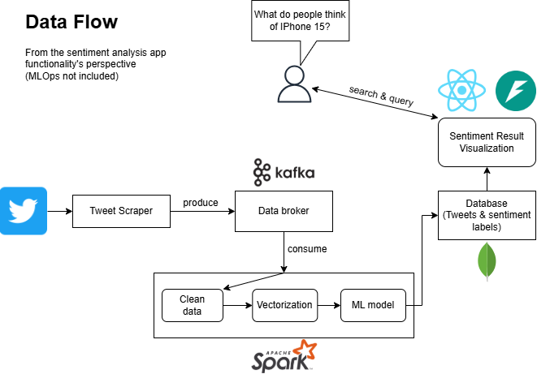

# Sentiment analysis in brand monitoring using Apache Spark and Kafka

## 👨‍💻 About
This is the repo for deploying sentiment analysis using Kafka, Spark and Kubernetes.

## 📑 Workflow diagram

+ **Tweet scraper**: Collect tweets from Twitter and send (produce) them to Kafka.
+ **Kafka data broker**: Store tweets in topic.
+ **Spark cluster**: Read (consume) tweets from Kafka topic, load pre-trained model, run sentiment analysis and save result to a database.
+ **MongoDB database**: Store sentiment results
+ **Sentiment visualization**: Read data from database, aggregate them and visualize via web app.
+ **End-user**: Search for a product (e.g Iphone 15) and see visualization.

## 📁 Repository info
The repo structure is as follows:
+ `/app`: Contains code for a CLI-based Tweet scraper. This tool scrapes data and send to Apache Kafka. It can be containerized to run in K8s.
+ `/kubernetes`: Contains YAML files to deploy resources on K8s.
+ `/spark`: Contains codes that serves as "tasks" to submit into Apache Spark. Check the folder's README for more info.