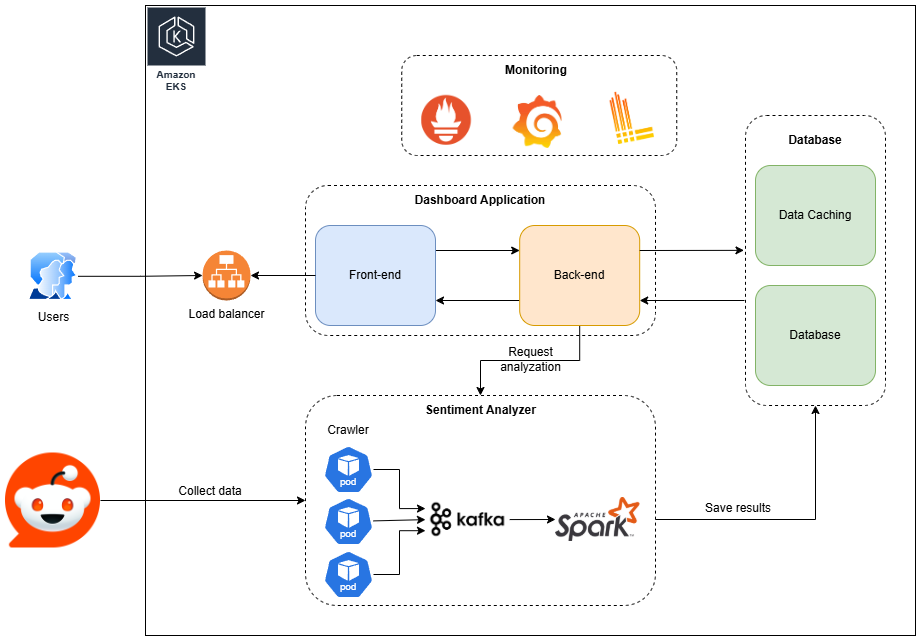

# Sentiment analysis in brand monitoring using Apache Spark and Kafka


## 👨‍💻 About
This is the repo for deploying sentiment analysis using Kafka, Spark and Kubernetes.

## 📑 Workflow diagram

+ **Dashboard Application**: The app that users interact with
+ **Sentiment Analyzer**: Handles on-demand sentiment analysis of products
+ **Database**: Stores and caches data
+ **Monitoring (WIP)**: Monitor cluster performance

## 📁 Repository info
The repo structure is as follows:
+ `/kubernetes`: Contains YAML files to deploy resources on K8s. Those includes:
    - `crawler-server`
    - `kafka`
    - `spark`
    - `redis`
    - `dashboard`
+ `/spark`: Contains codes that serves as "tasks" to submit into Apache Spark. Check the folder's README for more info.

Deploy cluster:
```bash
aws eks update-kubeconfig --name devops-eks-cluster --region us-east-1
```